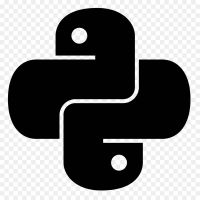

 # Practicas de Python 
Practicas desarrolladas en el curso de python 

**Requisitos del curso**
- Python 3.8 en adelante
- De preferencia un IDE ([Visual Estudio Code](https://code.visualstudio.com/) o [Pycharm](https://www.jetbrains.com/es-es/pycharm/))
- PC con Windows, Linux o MacOs